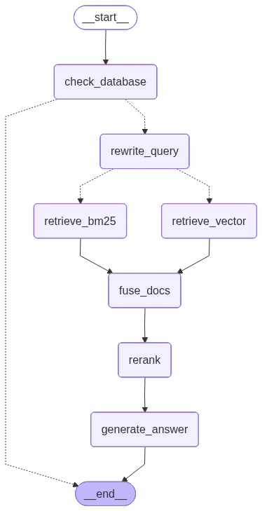

# RAG Demo - Advanced PDF Question Answering System

[](https://www.python.org/downloads/)
[](https://github.com/langchain-ai/langgraph)
[](https://opensource.org/licenses/MIT)

A Retrieval-Augmented Generation (RAG) demo system built with LangGraph, featuring hybrid retrieval, LLM-based rerank, and intelligent caching.

## Key Features

- **Hybrid Retrieval**: Combines semantic search (E5 embeddings) with keyword matching (BM25)
- **Query Rewriting**: Generates 3 query variants for improved document recall
- **Reciprocal Rank Fusion**: Intelligently merges results from multiple retrievers
- **LLM-based Reranking**: Selects the most relevant chunks using language models
- **Intelligent Caching**: JSONL-backed cache prevents redundant computations (It can be expanded into a database format in the future.)
- **Citation Generation**: Automatically tracks and cites sources in answers 
- **Model Warmup**: Pre-loads all models at startup for sub-second response times (In the future, both the embedding model and the vector database can be developed as separate services and interconnected via APIs.)
- **Multi-Provider Support**: Works with Groq, OpenAI, Anthropic, or Google AI

## Current Scope & Limitations

This project is currently provided as a **demo / reference implementation** of an advanced RAG system.

At this stage:
- Only **PDF documents** are supported as input sources
- Document ingestion is based on a PDF loader pipeline
- Other formats (e.g. DOCX, Markdown, HTML, web pages) are **not yet supported**

The architecture is designed to be **easily extensible**, and support for additional document formats
can be added in the future by extending the document loader and preprocessing pipeline.

## Architecture

<div align="center">
  
</div>

## Prerequisites

### Required
- **Python 3.12+**
- **[uv](https://docs.astral.sh/uv/)** - Modern Python package manager
- **LLM API Key** - Choose one:
  - [Groq](https://console.groq.com/keys) (recommended - free tier available)
  - [OpenAI](https://platform.openai.com/api-keys)
  - [Anthropic](https://console.anthropic.com/)
  - [Google AI](https://aistudio.google.com/apikey)

### Optional (for Docker deployment)
- **Docker** & **Docker Compose** - For containerized deployment
- Docker provides PostgreSQL (memory), Redis (for LangGraph), and LangGraph API

## Quick Start

### Option 1: Docker Deployment (Recommended)

Perfect for production use with persistent memory and caching.

#### Step 1: Setup Environment

```bash
# Clone and navigate
git clone https://github.com/Wheeler2024/rag_demo.git
cd rag_demo

# Configure API keys
cp .env.example .env
# Edit .env and set:
#   MODEL_PROVIDER=groq
#   GROQ_API_KEY=your_actual_key_here
#   RESPONSE_MODEL=model_name
#   RERANK_MODEL=model_name
```

#### Step 2: Add Documents & Build Vector Store

```bash
# Add your PDF files
cp /path/to/your/pdfs/*.pdf data/raw/

# Install dependencies and build vector store
uv sync
uv run python scripts/build_vectorstore.py
```

**Building takes 2-5 minutes** depending on PDF size. This creates:
- `data/vector_store/chroma/` - Semantic embeddings
- `data/vector_store/bm25_retriever.pkl` - Keyword index

#### Step 3: Launch Services

```bash
# Build and start all containers
docker-compose build

# Monitor startup (wait ~60s for model warmup)
docker-compose up -d; docker-compose logs -f langgraph-api
```

>**Note:** When starting the service for the first time, the application will perform a warm-up process. This warm-up phase typically takes around **60–70 seconds**.
Once you see output similar to the following. You can now proceed to **Step 4**.
```
...[info     ] Application started up in [??]s...
...[info     ] Application startup complete...
...[info     ] Uvicorn running on http://0.0.0.0:8000 (Press CTRL+C to quit)
```

#### Step 4: Access Application

**Option A: Agent Chat UI (Recommended)**
1. Visit [https://agentchat.vercel.app/](https://agentchat.vercel.app/)
2. Enter settings:
   - **Deployment URL**: `http://localhost:2024`
   - **Graph ID**: `rag_demo`
3. Start chatting!

---

### Option 2: Local Development (No Docker)

Faster iteration for development and testing.

#### Step 1: Setup Environment

```bash
# Clone and configure
git clone https://github.com/Wheeler2024/rag_demo.git
cd rag_demo
cp .env.example .env
# Edit .env with your API key

# Install dependencies
uv sync

# The project must be installed as a package
uv pip install -e .
```

#### Step 2: Build Vector Store

```bash
# Add PDFs to data/raw/
cp /path/to/pdfs/*.pdf data/raw/

# Build indices
uv run python scripts/build_vectorstore.py
```

#### Step 3: Start Development Server

```bash
# Run LangGraph dev server
uv run langgraph dev

# Server starts at http://localhost:2024
```

>**Note**: The development server is a built-in feature of Langgraph. You can use the chat mode in the top-left corner of the screen to test conversations.

---

## Project Structure

```
rag_demo/
├── src/
│   ├── agent.py              # Main LangGraph workflow definition
│   ├── state.py              # RAGState with custom reducers
│   ├── config.py             # Configuration (models, paths, settings)
│   ├── nodes/
│   │   ├── cache.py          # Cache check node (JSONL logs)
│   │   ├── rewriter.py       # Query rewriting node
│   │   ├── retrievers.py     # Vector & BM25 retrieval nodes
│   │   ├── fusion.py         # RRF fusion node
│   │   ├── reranker.py       # LLM-based reranking node
│   │   └── generator.py      # Answer generation node
│   └── utils/
│       ├── models.py         # Cached LLM client factory
│       └── vectorstore.py    # Cached embedding & retriever loaders
│
├── data/
│   ├── raw/                  # Place your PDF files here
│   └── vector_store/         # Generated embeddings & BM25 index
│
├── scripts/
│   ├── build_vectorstore.py  # Vector store builder
│   └── cleanup.py            # Delete vector store & rebuild
│
├── logs/                     # Q&A session logs (auto-created)
│
├── docker-compose.yml        # Multi-container orchestration
├── Dockerfile                # LangGraph API container
├── entrypoint.sh             # Container startup script
├── langgraph.json            # LangGraph configuration
├── pyproject.toml            # Python dependencies (uv)
├── .env.example              # Environment template
└── README.md                 # This file
```

## Configuration

### Environment Variables (.env)

```bash
# IMPORTANT:
# - Only one LLM provider should be active at a time
# - When switching providers, update MODEL_PROVIDER accordingly
# - Comment out API keys and model settings for providers you are NOT using
# - Uncomment and configure ONLY the selected provider below

# Choose your LLM provider
MODEL_PROVIDER=groq  # Options: groq, openai, anthropic, google

# Groq Configuration (recommended for free tier)
GROQ_API_KEY=your_groq_api_key
RESPONSE_MODEL=model_name  # Main answer model
RERANK_MODEL=model_name    # Reranker

# OpenAI Configuration
...

# Anthropic Configuration
...

# Google AI Configuration
...

# Optional for evaluation and tracing
# LANGSMITH_API_KEY=your_langsmith_api_key
# LANGSMITH_TRACING=true
# LANGSMITH_PROJECT="rag_demo"
```

### Advanced Settings (src/config.py)

```python
# Embedding configuration
EMBEDDING_MODEL = "intfloat/multilingual-e5-base"
EMBEDDING_BATCH_SIZE = 8  # Reduce if OOM errors

# Retrieval configuration
TOP_K_FUSION = 15   # Documents after RRF fusion
TOP_K_FINAL = 5     # Documents after reranking (sent to LLM)
```

### Answer Format

Answers include **source tracking** with references to the originating documents.

```
The Transformer architecture uses multi-head attention with 8 heads. The model achieved a BLEU score of 28.4 on WMT 2014 English-to-German translation.

Sources:
attention_paper.pdf-page 5-chunk 1
attention_paper.pdf-page 7-chunk 2
```

> **Planned**:
> - Inline citations (sentence-level)
> - Stable citation indices (`[1]`, `[2]`)
> - Improved citation precision for long answers

## Common Operations

### Adding New Documents

```bash
# 1. Add PDFs to raw directory
cp new_document.pdf data/raw/

# 2. Rebuild vector store
uv run python scripts/build_vectorstore.py

# 3. Restart Docker (if using Docker)
docker-compose restart langgraph-api
```

### Viewing Logs

```bash
# Docker logs
docker-compose logs -f langgraph-api

# Check all services
docker-compose ps
```

### Cleaning Up

```bash
# Stop and remove containers
docker-compose down

# Remove vector store and rebuild
uv run python scripts/cleanup.py
uv run python scripts/build_vectorstore.py
```

## Troubleshooting

### "Vector store not found" Error

**Cause**: Vector store must be built locally before Docker startup.

**Solution**:
```bash
uv run python scripts/build_vectorstore.py
docker-compose up -d
```

### Out of Memory Errors

**Symptom**: Process killed during embedding generation.

**Solutions**:
1. Reduce batch size in `src/config.py`:
   ```python
   EMBEDDING_BATCH_SIZE = 8  # or lower
   ```
2. Use smaller PDFs or split large documents

### Slow Startup in Docker

**Expected**: First startup takes ~60 seconds for model warmup.

**Verification**: Check logs show warmup completion:
```bash
docker-compose logs langgraph-api | grep "Warmup complete"
```

### API Rate Limits (Groq)

Groq **free tier rate limits vary by model** and are defined across multiple dimensions, like **RPM** – Requests per minute or **TPD** – Tokens per day etc.

**Solutions**:
- Wait and retry after the rate window resets  
- Switch to a different Groq model with higher limits  
- Upgrade to a paid tier (if available)  
- Switch to another provider in `.env` (OpenAI, Anthropic, or Google)

## Technologies

| Component           | Technology                         | Purpose                                 |
| ------------------- | ---------------------------------- | --------------------------------------- |
| **Orchestration**   | LangGraph 1.0.5                    | Graph-based workflow engine             |
| **LLM Inference**   | Groq / OpenAI / Anthropic / Google | Answer generation & reranking           |
| **Embeddings**      | Sentence Transformers (E5)         | Semantic vector search                  |
| **Vector Store**    | ChromaDB                           | Persistent vector storage               |
| **Keyword Search**  | Rank-BM25                          | Traditional IR for hybrid retrieval     |
| **Memory**          | PostgreSQL + pgvector              | Conversation history & cache            |
| **Caching**         | JSONL Log Files                    | Question/answer cache for fast response |
| **Container**       | Docker + Compose                   | Isolated deployment                     |
| **Package Manager** | uv                                 | Fast Python dependency management       |


## Acknowledgments

- Built with [LangGraph](https://github.com/langchain-ai/langgraph) and [LangChain](https://github.com/langchain-ai/langchain)
- E5 multilingual embeddings from [Microsoft/unilm](https://github.com/microsoft/unilm/tree/master/e5)
- Inspired by advanced RAG techniques from the research community
- [Agent-chat-ui](https://github.com/langchain-ai/agent-chat-ui) for frontend
